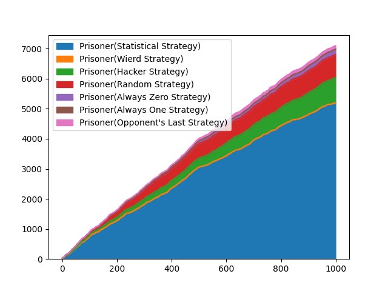

# Prisoner's dilemma

It is a zero-player game, it simulates the game between different strategies in the prisoner's dilemma.
[More about the prisoner's dilemma](https://en.wikipedia.org/wiki/Prisoner%27s_dilemma)

Each prisoner decides whether to cooperate or defend himself. The prisonner's goal is to get the highest possible fight score for himself. There are many diffrent strategies to choose for prisoner. The strategy decides about choice of prisoner. Prisoners compete in tournaments.


## Example prisoner's dilemma score matrix

| A/B           | **B cooperates** | **B defects** |
|---------------|---------------|------------|
| **A cooperates** | 1/1           | 3/0        |
| **A defects**    | 0/3           | 2/2        |

*(you can customize that matrix in config.py file)*


## Example usage

Import module
```python
from prisonersdilemma import prisoners, strategies, tournaments
```

Initialize the tournament
```python
# choosing prisoners that will participate in the tournament
players = [
        prisoners.Prisoner(strategies.StatisticalStrategy),
        prisoners.Prisoner(strategies.WeirdStrategy),
        prisoners.Prisoner(strategies.HackerStrategy),
        prisoners.Prisoner(strategies.RandomStrategy),
        prisoners.Prisoner(strategies.AlwaysZeroStrategy),
        prisoners.Prisoner(strategies.AlwaysOneStrategy),
        prisoners.Prisoner(strategies.OpponentsLastStrategy)
    ]

# initalizing the tournament
tournament = tournaments.PrisonerStrengthenTournament(alive=players, rounds=1000)
```
 
Execute the tournament and show results
```python
tournament.start()
tournament.show_result()
```



*show_result method will print the winner or show matplotlib plot (depends on tournament type)*
